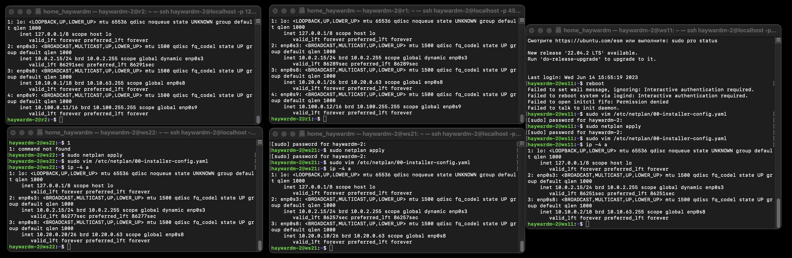
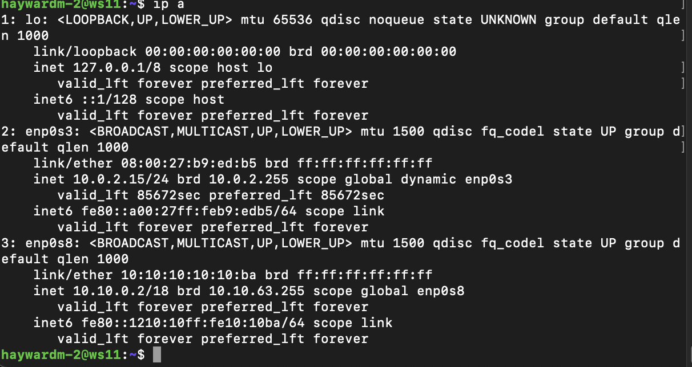
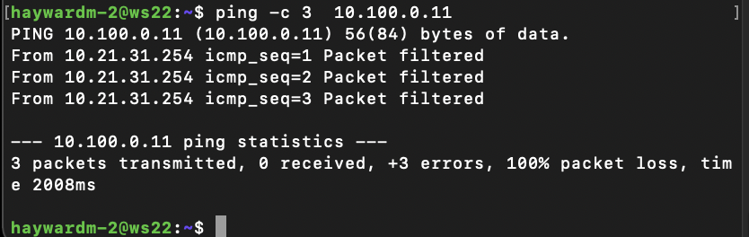

## ```1.1. Сети и маски```

 - ###  Для скачивания *ipcalc* нужнно ввести команду - *sudo apt-get install ipcalc*
 # 

- ### Для проверки адреса сети я ввел команду ipcalc *192.167.38.54/13* - *192.160.0.0*
# 

- ### Для проверки адресса я ввел ipcalc *255.255.255.0*
- ####  На скрине в поле NetMask: можно увидеть префиксную маску: /24 и 1111111111.11111111.111111.00000000
# 

- ###  Перевел префикс /15 коммандой ipcal /15 - 255.254.0.0 и 11111 11111.11111110.00000000.00000000
# 
 - ### Маска подсети *11111111.11111111.11111111.11110000* в обычной записи: *255.255.255.240* или */28*
- ### Max и Min хост в сети *12.167.38.4* при масках: */8*, *11111111.11111111.00000000.00000000*, *255.255.254.0* и */4*
- #### С помощью таблицы переводим все значения в префиксные.
- ##### *11111111.11111111.00000000.00000000* - /16
- ##### *255.255.254.0* - /23


# 

# ```1.2. localhost```
#  


## Определить и записать в отчёт, можно ли обратиться к приложению, работающему на localhost, со следующими IP: *194.34.23.100*, *127.0.0.2*, *127.1.0.1*, *128.0.0.1*
### Моё решение: Чтобы узнать можно ли обратиться к приложению, мы должны прописать ipcalc <adress> если есть loopback то можно обратиться или можно без ipcalc вручную, то есть через диапазон

Локальная сеть использует эти диапазоны. И всегда начинаеться с 127.
- ### Loopback - дает знать о то, что можно обратиться к приложению
 - ```Проходят - 127.1.0.1, 127.0.0.2```
 - ```Не проходят - 194.34.23.100, 128.0.0.1```


# ```1.3. Диапазоны и сегменты сетей```
## Определить и записать в отчёт:
## 1) какие из перечисленных IP можно использовать в качестве публичного, а какие только в качестве частных: *10.0.0.45*, *134.43.0.2*, *192.168.4.2*, *172.20.250.4*, *172.0.2.1*, *192.172.0.1*, *172.68.0.2*, *172.16.255.255*, *10.10.10.10*, *192.169.168.1*
 - Итак, задача сложная, но есть решение: Первое, что я сделаю - это посмотрю все адреса через ipcalc, а потом уже можно будет подумать. Какие вообще бывают Ип адреса? И бывают ли они...?
 - Ит адреса бываю в двух видах. Первый вид публичный и частный. Частный ип адрес юзают в локальных сетях, они могут быть в виду домашнего или офисного вайфая, типо как роуртер. Их адрес не уникальный и могут использовать несколько устроиств) Частный ип адрес нельзя использовать дл] доступа к ресурсам глобальной сети, так как это все в локальной системе. 
 - А вот публичные (глобальные) уже поинтерестнее))) Они уже используются в глобальной сети, эти адреса уникальные и может использовать только одно устроиство, то есть по публичному ип адресу можно уже узнать побольше инфы, к примеру какой телефон или с какого города, так как ип адрес (публичный) несёт в себе больше информации чем частный.

 ```Узнайте диапазон частных IP-адресов. 3 сегмента IP-адресов включают 10.0.0.0~10.255.255.255, 172.16.0.0~172.31.255.255 и 192.168.0.0~192.168.255.255. ```
     ``` Если входит в диапазон то приват, то есть все 10. приват ```
 - 1. 10.0.0.45 - private
 - 2. 134.43.0.2 - public
 - 3. 192.168.4.2 - private
 - 4. 172.20.250.4 - private
 - 5. 172.0.2.1 - public
 - 6. 192.172.0.1 - public
 - 7. 172.68.0.2 - public
 - 8. 172.16.255.255 - private
 - 9. 10.10.10.10 - private
 - 10. 192.169.168.1 - public

## ```Какие из перечисленных IP адресов шлюза возможны у сети *10.10.0.0/18*: *10.0.0.1*, *10.10.0.2*, *10.10.10.10*, *10.10.100.1*, *10.10.1.255*```
## Первое что мы делаем: ipcalc 10.10.0.0/18
## Теперь мы определяем диапазоны.


- не может именть Ip-адреса шлюзов ```10.0.0.1```, ```10.10.100.1``` 
- И может иметь ```10.10.0.2```, ```10.10.10.10```, ```10.10.1.255```
- Так как не входит в диапазоны.

## ```Part 2. Статическая маршрутизация между двумя машинами``` 
- ## Создаем (клонируем) вторую вертуальную машину и называем ws1 и ws2
# 
- ### Запускаем сразу две машины и прописываем команду ip a чтобы посмотреть существующие сетевые интерфейсы 
- ```1 машина вертуалка```

- ```2 машина вертуалка```

### ``` lo или local loopback (локальная петля). Служит для подключения по сети к этому же компьютеру и не требует дополнительной настройки; ```

.
### ``` enp0s3 - первый сетевой адаптер работающий в NAT режиме.```

- ### У ```первой``` машины:
- lo: 127.0.0.1/8 
- enp0s3: 10.0.2.15/24

- ### У ```второй``` машины:
- lo: 127.0.0.1/8 
- enp0s3: 10.0.2.15/24

.

.


### ``` Описать сетевой интерфейс, соответствующий внутренней сети, на обеих машинах и задать следующие адреса и маски: ws1 - *192.168.100.10*, маска */16*, ws2 - *172.24.116.8*, маска */12*```
## - Для того чтобы описать сетевой интерфейс мы заходим в консоль и прописываем команду sudo vim/nano /etc/netplan/00-installer-config.yaml ```|```  в пункте dhcp4 - меняем на false для доступа к применимых данных.
## - Теперь когда мы уже зашли на одной из консоли применяем адпресс 192.168.100.10/16, а на другой 172.24.116.8/12


- ## После данных процедур иы прописываем команду для сохранения данных в natplan -  ```sudo natplan apply``` на двух машинах
 
 # ``` 2.1. Добавление статического маршрута вручную```
### Чтобы добавить статический маршрут от одной тачки в другую нужно ввести две команды, а именно  ```->```
 1)```sudo ip r add``` 172.24.116.8 dev enp0s3

 2)```sudo ip r add``` 172.24.116.8 dev enp0s3
# 


## ```2.2. Добавление статического маршрута с сохранением```
 - ## Перезагружаем все машины через ```reboot```
  - ### Добавить статический маршрут от одной машины до другой с помощью файла *etc/netplan/00-installer-config.yaml*
  - ### Для этого квеста мы должны так же зайти в описание сетевых интерфейсов. И там уже добавить новый пункт: ```routes```
  - ### В routes еще два пункта: - to; via где to нужно вводить тот адрес, к которой машине ты хочешь отправить статический маршрут, а в via повторяешь адрес который изначально писал в адрессес, но только без маски.


## ```Пропинговать соединение между машинами```
### - Вызов через пинг - ping ```adress``` у двух машин, так же можно использовать ping -c 3 adress, чтобы отправить 3 пакета
 ##### Пропинговать соединение между машинами
 
 
 
## ```Part 3. Утилита **iperf3**```
- ## Скачиваем данную утилиту командой - sudo apt-get install iperf3

### - Чтобы установить нужно подключить сеть, а чтобы её подключить нужно зайти в настройки -> сеть -> адаптер 2 -> поставить галочку и проверить чтобы это была внутренняя сеть, потом запускаем машину и проверяем через пинг 8.8.8.8 на наличие работоспасобности

### - Если не получается нужно снести файл cat /etc/netplan/*yaml и обносить через sudo netplan apply. И потом уже скачать!
## ``` 3.1. Скорость соединения```
- ### ```8``` Мбит/с = ```1``` МБ/с
- ### ```100``` МБ/с = ```800000``` Кбит/с
- ### ```1``` Гбит/с = ```1000 ``` Мбит/с
## ``` 3.2. Утилита **iperf3**```
## Измерить скорость соединения между ```ws1``` и ```ws2```
 ### ```1) на одной машине прописываем команду iperf3 -s -f k ```
 ### ```2)на второй iperf3 -c 192.168.100.10 -s K```
 - ## ФЛАГИ: 
 ### ```-с``` (запуск клиента и подключение к серверу (хосту) )
 ### ```-s``` (запуск сервера с отображением информации на экране (консоли) )
 ### ```-f [буква]``` (формат скорости в рузультатах теста) так как я использую ```k``` формат моей скорости будет в ```Кбит``` и еще я использую формат ```K``` это в ```Кбайт```

# 


## ```Part 4. Сетевой экран ```
## ```4.1. Утилита **iptables**```
Итак, по заднию я создал файл набрав одну команду
sudo touch /etc/firewall.sh
и потом зашел в него через вим и ввел новую информацию
sudo vim /etc/firewall.sh
после всех этих операций перешел на вторую машину и делал на второй 
чтобы проверить (скомпилировать ввел уже две команды)
sudo chmod +x /etc/firewall.sh 
sudo /etc/firewall.sh
если есть ошибки он сразу ввыводит их в консоль 
вот скрин на то что я ввел в в firewall.sh 

Что такое iptables??
- это утилита, которая отвечает за команду строки
- Для этого задания нужно:
1) На первой аертуальной машине поменять стратецию iptables в начале пишется запрещяющее правило, а в конце пишется разрешающее правило 
 2) На второй вертуальной машине оменять стратегию iptables в начале пишем разрешающее правило, а в конце запрещающее правило 
3) Открываем на машинах доступ для порта 80 и 20 http
4) запретить echo eply => машина прекращает пинговаться, срабатывает ```блокировка```.
5) разрешаем echo reply => машина будет пинговаться 


## ``` 4.2. Утилита **nmap** ```

в первой и второй машинке прописываем две команды ping 172.24.116.8 и ping 192.168.100.10 и потом уже проверяем значения, так как мы запустили дроп который мы написали в прошлом квесто, то одна из машин не будет пинговать это можно увидеть на скрине 

для этого мы используем утилиту nmap чтобы проверить на ошибка 
nmap 192.168.100.10
может быть такое, что он не скачен и его нужно скачать через sudo apt install nmap


## Part 5. Статическая маршрутизация сети

`-` Пока что мы соединяли всего две машины, но теперь пришло время для статической маршрутизации целой сети.

**== Задание ==**

Сеть:


##### Поднять пять виртуальных машин (3 рабочие станции (ws11, ws21, ws22) и 2 роутера (r1, r2))

#### 5.1. Настройка адресов машин
##### Настроить конфигурации машин в *etc/netplan/00-installer-config.yaml* согласно сети на рисунке.
- В отчёт поместить скрины с содержанием файла *etc/netplan/00-installer-config.yaml* для каждой машины.

##### Перезапустить сервис сети. Если ошибок нет, то командой `ip -4 a` проверить, что адрес машины задан верно. Также пропинговать ws22 с ws21. Аналогично пропинговать r1 с ws11.

- В отчёт поместить скрины с вызовом и выводом использованных команд.
#### 5.2. Включение переадресации IP-адресов.
##### Для включения переадресации IP, выполните команду на роутерах:
`sysctl -w net.ipv4.ip_forward=1`
*При таком подходе переадресация не будет работать после перезагрузки системы.*

- В отчёт поместить скрин с вызовом и выводом использованной команды.
##### Откройте файл */etc/sysctl.conf* и добавьте в него следующую строку:
`net.ipv4.ip_forward = 1`
*При использовании этого подхода, IP-переадресация включена на постоянной основе.*
открываем и изменяем sudo vim/nano /etc/sysctl.conf 
а открываем sudo cat /etc/sysctl.conf 
- В отчёт поместить скрин с содержанием изменённого файла */etc/sysctl.conf*.


#### 5.3. Установка маршрута по-умолчанию
Пример вывода команды `ip r` после добавления шлюза:
```
default via 10.10.0.1 dev eth0
10.10.0.0/18 dev eth0 proto kernel scope link src 10.10.0.2
```


##### Настроить маршрут по-умолчанию (шлюз) для рабочих станций. Для этого добавить `default` перед IP роутера в файле конфигураций
- В отчёт поместить скрин с содержанием файла *etc/netplan/00-installer-config.yaml*.

_Фильтры_

`host` - имя хоста;\
`ip` - ip адрес;\
`proto` - протокол;\
`net` - адрес сети или подсети;\
`port` - адрес порта;\
`src` - параметр, касающийся отправителя;\
`dst` - параметр, касающейся получателя;\
Доступны такие протоколы: ether, fddi, tr, wlan, ip, ip6, arp, rarp, decnet, tcp и udp.

##### Вызвать `ip r` и показать, что добавился маршрут в таблицу маршрутизации
- В отчёт поместить скрин с вызовом и выводом использованной команды.

##### Пропинговать с ws11 роутер r2 и показать на r2, что пинг доходит. Для этого использовать команду:
`tcpdump -tn -i eth1`
- В отчёт поместить скрин с вызовом и выводом использованных команд.

версия из терминала

версия из консоли - 

#### 5.4. Добавление статических маршрутов
##### Добавить в роутеры r1 и r2 статические маршруты в файле конфигураций. Пример для r1 маршрута в сетку 10.20.0.0/26:
```shell
# Добавить в конец описания сетевого интерфейса eth1:
- to: 10.20.0.0
  via: 10.100.0.12
```
- В отчёт поместить скрины с содержанием изменённого файла *etc/netplan/00-installer-config.yaml* для каждого роутера.
##### Вызвать `ip r` и показать таблицы с маршрутами на обоих роутерах. Пример таблицы на r1:
```
10.100.0.0/16 dev eth1 proto kernel scope link src 10.100.0.11
10.20.0.0/26 via 10.100.0.12 dev eth1
10.10.0.0/18 dev eth0 proto kernel scope link src 10.10.0.1
```
- В отчёт поместить скрин с вызовом и выводом использованной команды.
##### Запустить команды на ws11:
`ip r list 10.10.0.0/[маска сети]` и `ip r list 0.0.0.0/0`


- В отчёт поместить скрин с вызовом и выводом использованных команд.
- В отчёте объяснить, почему для адреса 10.10.0.0/\[маска сети\] был выбран маршрут, отличный от 0.0.0.0/0, хотя он попадает под маршрут по-умолчанию.

IP-адрес 0.0.0.0 — это немаршрутизируемый адрес IPv4, который можно использовать в разных целях, в основном, в качестве адреса по умолчанию или адреса-заполнителя. Несмотря на то, что адрес 0.0.0.0 может использоваться в компьютерных сетях, он не является адресом какого-либо устройства. Маршрут с наибольшей длиной префикса всегда выигрывает среди маршрутов, установленных в таблице маршрутизации. Маршрут по умолчанию имеет наиболее низкий приоритет и срабатывает, когда не найден подходящий маршрут в таблице маршрутизации. Поэтому маршрут по умолчанию никогда не будет выбран, если есть альтернатива. \
У нас для сети 10.10.0.0 создано правило, поэтому используется данный маршрут.

#### 5.5. Построение списка маршрутизаторов
Пример вывода утилиты **traceroute** после добавления шлюза:

```
1 10.10.0.1 0 ms 1 ms 0 ms
2 10.100.0.12 1 ms 0 ms 1 ms
3 10.20.0.10 12 ms 1 ms 3 ms
```
##### Запустить на r1 команду дампа:
`tcpdump -tnv -i eth0`

##### При помощи утилиты **traceroute** построить список маршрутизаторов на пути от ws11 до ws21
- В отчёт поместить скрины с вызовом и выводом использованных команд (tcpdump и traceroute).
- В отчёте, опираясь на вывод, полученный из дампа на r1, объяснить принцип работы построения пути при помощи **traceroute**.
 
 
#### 5.6. Использование протокола **ICMP** при маршрутизации
##### Запустить на r1 перехват сетевого трафика, проходящего через eth0 с помощью команды:
`tcpdump -n -i eth0 icmp`
##### Пропинговать с ws11 несуществующий IP (например, *10.30.0.111*) с помощью команды:
`ping -c 1 10.30.0.111`

- В отчёт поместить скрин с вызовом и выводом использованных команд.

##### Сохранить дампы образов виртуальных машин
**p.s. Ни в коем случае не сохранять дампы в гит!**

## Part 6. Динамическая настройка IP с помощью **DHCP**

`-` Следующим нашим шагом будет более подробное знакомство со службой **DHCP**, которую ты уже знаешь.

**== Задание ==**

*В данном задании используются виртуальные машины из Части 5*

##### Для r2 настроить в файле */etc/dhcp/dhcpd.conf* конфигурацию службы **DHCP**:

##### 1) указать адрес маршрутизатора по-умолчанию, DNS-сервер и адрес внутренней сети. Пример файла для r2:
```shell
subnet 10.100.0.0 netmask 255.255.0.0 {}

subnet 10.20.0.0 netmask 255.255.255.192
{
    range 10.20.0.2 10.20.0.50;
    option routers 10.20.0.1;
    option domain-name-servers 10.20.0.1;
}
```

разбор - 
subnet 10.20.0.0 netmask 255.255.255.192 - функция 
range 10.20.0.2 10.20.0.50; - цикл айпи адресов 
option routers 10.20.0.1; - адрес роуртера 
option domain-name-servers 10.20.0.1; - домен

- он присваивает всем разные адреса но с одного сервера
##### 2) в файле *resolv.conf* прописать `nameserver 8.8.8.8.`

- В отчёт поместить скрины с содержанием изменённых файлов.
##### Перезагрузить службу **DHCP** командой `systemctl restart isc-dhcp-server`. Машину ws21 перезагрузить при помощи `reboot` и через `ip a` показать, что она получила адрес. Также пропинговать ws22 с ws21.
- В отчёт поместить скрины с вызовом и выводом использованных команд.


##### Указать MAC адрес у ws11, для этого в *etc/netplan/00-installer-config.yaml* надо добавить строки: `macaddress: 10:10:10:10:10:BA`, `dhcp4: true`
- В отчёт поместить скрин с содержанием изменённого файла *etc/netplan/00-installer-config.yaml*.


 так делать не нужно - > 
##### Для r1 настроить аналогично r2, но сделать выдачу адресов с жесткой привязкой к MAC-адресу (ws11). Провести аналогичные тесты
- В отчёте этот пункт описать аналогично настройке для r2.


##### Запросить с ws21 обновление ip адреса
- В отчёте поместить скрины ip до и после обновления.
- В отчёте описать, какими опциями **DHCP** сервера пользовались в данном пункте.




.

.

.

.

.

## Part 7. **NAT**


Для чего SNAT и DNAT + NAT 

- Наиболее популярным является ```SNAT```, суть механизма которого состоит в замене адреса источника (англ. source) при прохождении пакета в одну сторону и обратной замене адреса назначения (англ. destination) в ответном пакете. Наряду с адресами источник/назначение могут также заменяться номера портов источника и назначения.

- ```DNAT``` (Destination Network Address Translation) – используется для преобразования внешнего адреса в локальный. Применяется для перенаправления до локальных серверов.

- ```NAT``` (Network Address Translation, трансляция сетевых адресов) — это функция для изменения IP-адреса во время передачи пакетов Ethernet через маршрутизатор. Чаще всего используется для подключения устройств в локальной сети к сети Интернет, но может использовать и для других целей.


`-` Ну и, наконец, в качестве вишенки на торте, я расскажу тебе про механизм преобразования адресов.

**== Задание ==**

*В данном задании используются виртуальные машины из Части 5*
##### В файле */etc/apache2/ports.conf* на ws22 и r1 изменить строку `Listen 80` на `Listen 0.0.0.0:80`, то есть сделать сервер Apache2 общедоступным
- В отчёт поместить скрин с содержанием изменённого файла.


##### Запустить веб-сервер Apache командой `service apache2 start` на ws22 и r1
- В отчёт поместить скрины с вызовом и выводом использованной команды.

##### Добавить в фаервол, созданный по аналогии с фаерволом из Части 4, на r2 следующие правила:
##### 1) удаление правил в таблице filter - `iptables -F`
##### 2) удаление правил в таблице "NAT" - `iptables -F -t nat`
##### 3) отбрасывать все маршрутизируемые пакеты - `iptables --policy FORWARD DROP`


##### Запускать файл также, как в Части 4
sudo chmod +x /etc/firewall.sh 
sudo /etc/firewall.sh

##### Проверить соединение между ws22 и r1 командой `ping`
*При запуске файла с этими правилами, ws22 не должна "пинговаться" с r1*
- В отчёт поместить скрины с вызовом и выводом использованной команды.


##### Добавить в файл ещё одно правило:
##### 4) разрешить маршрутизацию всех пакетов протокола **ICMP**


##### Запускать файл также, как в Части 4
##### Проверить соединение между ws22 и r1 командой `ping`
*При запуске файла с этими правилами, ws22 должна "пинговаться" с r1*
- В отчёт поместить скрины с вызовом и выводом использованной команды.

##### Добавить в файл ещё два правила:
##### 5) включить **SNAT**, а именно маскирование всех локальных ip из локальной сети, находящейся за r2 (по обозначениям из Части 5 - сеть 10.20.0.0)
*Совет: стоит подумать о маршрутизации внутренних пакетов, а также внешних пакетов с установленным соединением*

iptables -A FORWARD -m state --state ESTABLISHED,RELATED -j ACCEPT

правило, в котором разрешение соединения используется для пересылки только пакетов, связанных с внешним соединением
##### 6) включить **DNAT** на 8080 порт машины r2 и добавить к веб-серверу Apache, запущенному на ws22, доступ извне сети
*Совет: стоит учесть, что при попытке подключения возникнет новое tcp-соединение, предназначенное ws22 и 80 порту*
- В отчёт поместить скрин с содержанием изменённого файла.

##### Запускать файл также, как в Части 4
*Перед тестированием рекомендуется отключить сетевой интерфейс **NAT** (его наличие можно проверить командой `ip a`) в VirtualBox, если он включен*
##### Проверить соединение по TCP для **SNAT**, для этого с ws22 подключиться к серверу Apache на r1 командой:
`telnet [адрес] [порт]`
##### Проверить соединение по TCP для **DNAT**, для этого с r1 подключиться к серверу Apache на ws22 командой `telnet` (обращаться по адресу r2 и порту 8080)
- В отчёт поместить скрины с вызовом и выводом использованных команд.


## Part 8. Дополнительно. Знакомство с **SSH Tunnels**

**== Задание ==**

*В данном задании используются виртуальные машины из Части 5*

##### Запустить на r2 фаервол с правилами из Части 7

##### Запустить веб-сервер **Apache** на ws22 только на localhost (то есть в файле */etc/apache2/ports.conf* изменить строку `Listen 80` на `Listen localhost:80`)
##### Воспользоваться *Local TCP forwarding* с ws21 до ws22, чтобы получить доступ к веб-серверу на ws22 с ws21
##### Воспользоваться *Remote TCP forwarding* c ws11 до ws22, чтобы получить доступ к веб-серверу на ws22 с ws11
##### Для проверки, сработало ли подключение в обоих предыдущих пунктах, перейдите во второй терминал (например, клавишами Alt + F2) и выполните команду:
`telnet 127.0.0.1 [локальный порт]`
- В отчёте описать команды, необходимые для выполнения этих четырёх пунктов, а также приложить скриншоты с их вызовом и выводом.


